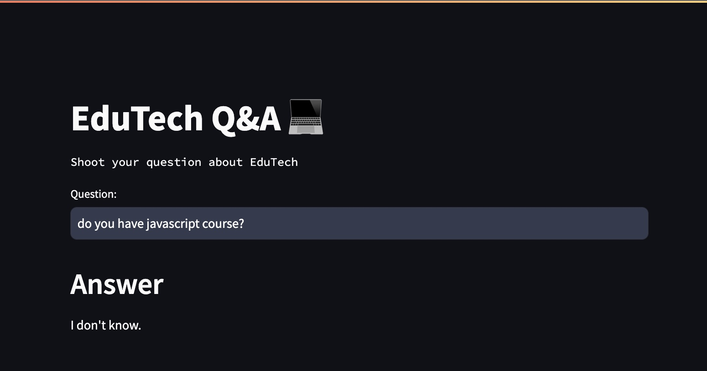

# Intelligent Query Response System

### Live Project

Click [here](https://edutech-solutions-q-a-system.streamlit.app/) to visit the live project.

## Overview

This project implements an advanced Question and Answer (Q&A) system using Google's Generative AI capabilities through Langchain. Here we have used the FAQ dataset of a made up online education platform EduTech specializing in data science courses and bootcamps. The solution significantly will reduce staff time spent on answering repetitive questions found in the FAQ dataset. This efficiency allows staff to focus on addressing unique inquiries or other user concerns beyond the scope of set of question in the dataset. This solution can be used by any organization for their custom dataset of queries.

### Project Highlights

- Integration of live CSV dataset with frequently asked questions.
- Implementation of Google Palm LLM-based Q&A system to enhance customer support efficiency.
- Streamlit-based user interface providing instant responses to student queries.
- Key learning components include Langchain integration, Streamlit UI development, Huggingface embeddings, and FAISS for vector database.

## Installation

1. Clone the repository:
git clone https://github.com/AditiGawande4/Intelligent-Query-Response-System.git

2. Navigate to the project directory:
cd Intelligent-Query-Response-System

3. Install dependencies:
pip install -r requirements.txt

4. Create a `.env` file. Obtain a Google API key from makersuite.google.com and add it to `.env` file:
GOOGLE_API_KEY="your_api_key_here"

5. In the langchain_helper.py file change line 14 to:
llm = GoogleGenerativeAI(model="models/text-bison-001",google_api_key=os.environ["GOOGLE_API_KEY"], temperature=0)

## Usage

- Run the Streamlit app:
streamlit run main.py

- Access the web application in your browser.

- Enter your query in the provided box to get instant answers.

## Sample Questions

- Are internships available? Do you offer payment plans?
- Is there a JavaScript course available?
- Should I learn Power BI or Tableau?
- Can Power BI be used on a Mac computer?
- How can I enable Power Pivot if it's not visible?

## Project Structure

- `main.py`: Main script for the Streamlit application.
- `langchain_helper.py`: Contains essential Langchain integration code.
- `requirements.txt`: List of required Python packages.
- `.env`: Configuration file for storing Google API key.

This project aims to optimize the customer support system, ensuring timely and accurate responses to student queries while enhancing user satisfaction and engagement.
